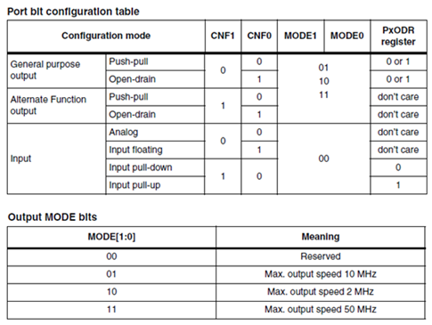
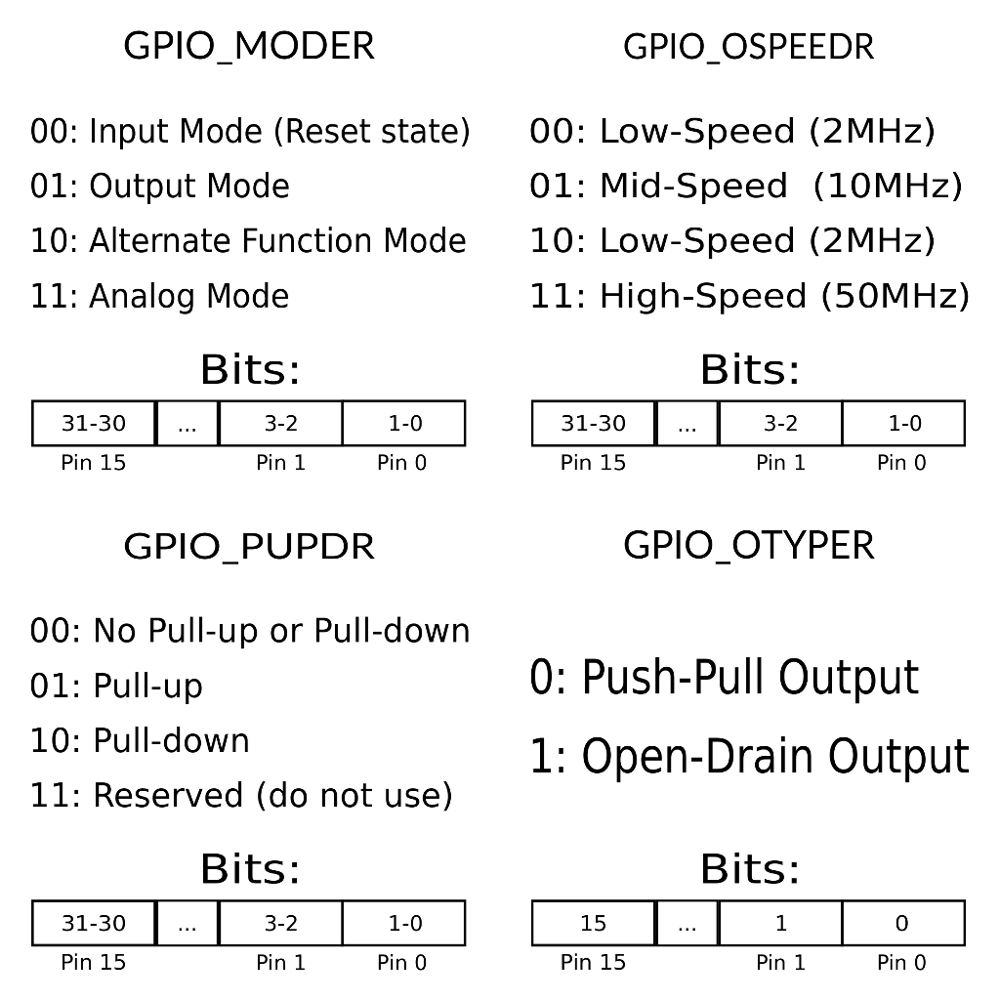

## STM32 GPIO Registers and Programming


## Bit Setting in C

#### Setting a bit

Use the bitwise OR operator ( | ) to set a bit.
``` c
number |= 1 << x;
```
That will set bit x.

#### Clearing a bit

Use the bitwise AND operator (&) to clear a bit.
``` c
number &= ~(1 << x);
```
That will clear bit x. You must invert the bit string with the bitwise NOT operator (~), then AND it.

#### Toggling a bit

The XOR operator (^) can be used to toggle a bit.<br>
``` c
number ^= 1 << x;
```
That will toggle bit x.

#### Checking a bit

To check a bit, shift the number x to the right, then bitwise AND it:
``` c
bit = (number >> x) & 1;
```
That will put the value of bit x into the variable bit.

#### Changing the nth bit to x

Setting the nth bit to either 1 or 0 can be achieved with the following:

```c
number ^= (-x ^ number) & (1 << n);
```
Bit n will be set if x is 1, and cleared if x is 0.

## GPIO Registers

The `stm32CubeIDE` generated code provides access to registers by the syntax:

```cpp
GPIOA->REG
```
where REG can be one of the following:

#### CRH and CRL

**CRH** is used to set type/and or speed of pins 8-15 of the port. <br>
**CRL** is used to set type/and or speed of pins 0-7 of the port. <br>
Accessed as a 32 bit word, with 4 bits representing the state of each pin. Out of these 4 bits, the low 2 bits are MODE, and high 2 bits are CNF.



The 4 bits for each pin can be set to:  
0b0011 (binary) or 0x3 (HEX) - Corresponds to setting pin as output, same as pinMode()  
0b1000  or 0x8 - Corresponds to setting pin as input, same as pinMode()

Say I want to set PORTA pins 0, 3 and 4 to OUTPUT and 1, 6, 7 to INPUT, and leave pins 2 and 5 in their original state. The code is:
```cpp
PORTA->CRL = (PORTA->CRL & 0x00F00F00) | 0x88000080 |0x00033003;
//0x00F00F00 is bitmask to retain value of pins 2 and 5 in original state
//0x88000080 is bitmask to set inputs
//0x00033003 is bitmask to set outputs
```

#### IDR - Input Data Register
Used to read input of entire 16 pins of port at once. Accessed as a 32 bit word whose lower 16 bits represent each pin.
The pins being read must be set to INPUT mode by using CRL/CRH or pinMode() before using this.

Say I want to read pins A2. The code is:
```cpp
bool result = GPIOA->IDR & 0x0004; //returns true if A2 is HIGH
//0x0004 is 0b0000000000000100
```

#### ODR - Output Data Register
Used to write output to entire 16 pins of port at once. Accessed and written as a 32 bit word whose lower 16 bits represent each pin.
The pins being read must be set to OUTPUT mode by using CRL/CRH or pinMode() before using this.

Say I want to set pins A2, A12 and A13, and **reset (clear)** all other pins in the 16 pin bus. The code is:
```cpp
GPIOA->ODR = 0b0011000000000100; //note,  binary
```

Now if I want to set and clear A2, A12 and A13 **without** altering other pins, the code is:

```cpp
//Set A2, A12, A13 (HIGH)
GPIOA->ODR |= 0b0011000000000100;
//Clear A2, A12, A13 (LOW)
GPIOA->ODR &= ~(0b0011000000000100);
```

but notice how, if we want to touch only some pins, we have to READ, MASK and WRITE. That's why there is BRR and BSRR

#### BRR - Bit Reset Register
32 bit word. Lower 16 bits have 1's where bits are to be set to "LOW". Upper 16 bits have 1's where bits are to be set "HIGH".
**0's mean ignore**

Now, to set and clear A2, A12, A13 while preserving the state of all other pins in the port, the code is:

```cpp
//Set A2, A12, A13 (HIGH)
GPIOA->BRR = 0b0011000000000100 << 16; //move to upper 16 bits
//Clear A2, A12, A13 (LOW)
GPIOA->BRR = 0b0011000000000100;
```

#### BSRR - Bit Set Reset Register

BSRR is like the complement of BRR. It's also a 32 bit word. Lower 16 bits have 1's where bits are to be set to "HIGH". Upper 16 bits have 1's where bits are to be set "LOW".
**0's mean ignore**

In this case, to set and clear A2, A12, A13 while preserving the state of all other pins in the port, the code is:

```cpp
//Set A2, A12, A13 (HIGH)
GPIOA->BSRR = 0b0011000000000100;
//Clear A2, A12, A13 (LOW)
GPIOA->BSRR = 0b0011000000000100 << 16; //move to upper 16 bits
```

#### Combination of BRR and BSRR

Since BRR and BSRR are opposite of each other, you can use both if you don't want to do the bit shift left operation .

In this case, to set and clear A2, A12, A13 while preserving the state of all other pins in the port, the code is:

```cpp
//Set A2, A12, A13 (HIGH)
GPIOA->BSRR = 0b0011000000000100; //lower 16 bits
//Clear A2, A12, A13 (LOW)
GPIOA->BRR = 0b0011000000000100; //lower 16 bits
```

## Setting up GPIO pins



__under construction__ 🙈

#### PUPDR - Pull-up/Pull-down Register

```cpp
// clear registers (may not be approrpiate in all cases)
GPIOX->PUPDR &= ~(0x3 << (2 * pinNumber))

// pullType can be one of:
// no pull-up or pull-down: 0x0
// pull-up:                 0x1
// pull-down:               0x2
// reserved:                0x3
GPIOX->PUPDR |= (pullType << (2 * pinNumber))
```

#### Sources:  
* http://embedded-lab.com/blog/stm32-gpio-ports-insights/  
* http://hertaville.com/stm32f0-gpio-tutorial-part-1.html
* http://stackoverflow.com/questions/47981/how-do-you-set-clear-and-toggle-a-single-bit-in-c-c?rq=1
* https://gist.github.com/iwalpola/6c36c9573fd322a268ce890a118571ca
* https://gist.github.com/Vitorbnc/e35f1ff1485d660edf365241dacfa387

## Articles Worth Reading

* "Bare Metal" STM32 Programming Series:
    * [(Part 1): Hello, ARM!](https://vivonomicon.com/2018/04/02/bare-metal-stm32-programming-part-1-hello-arm/)
    * [(Part 2): Making it to ‘Main’](https://vivonomicon.com/2018/04/20/bare-metal-stm32-programming-part-2-making-it-to-main/)
    * [(Part 3): LEDs and Buttons!](https://vivonomicon.com/2018/04/22/bare-metal-stm32-programming-part-3-leds-and-buttons/)
    * [(Part 3.5): Supporting Multiple Chips](https://vivonomicon.com/2018/04/25/bare-metal-stm32-programming-part-3-5-supporting-multiple-chips/)
    * [(Part 4): Intro to Hardware Interrupts](https://vivonomicon.com/2018/04/28/bare-metal-stm32-programming-part-4-intro-to-hardware-interrupts/)
    * [(Part 5): Timer Peripherals and the System Clock](https://vivonomicon.com/2018/05/20/bare-metal-stm32-programming-part-5-timer-peripherals-and-the-system-clock/)
    * [(Part 6): Multitasking With FreeRTOS](https://vivonomicon.com/2018/08/23/bare-metal-stm32-programming-part-6-multitasking-with-freertos/)
    * [(Part 7): Embedded C++ Inheritance](https://vivonomicon.com/2018/09/05/bare-metal-stm32-programming-part-7-embedded-c-inheritance/)
    * [(Part 8): Learn to Debug Timing Issues with Neopixels](https://vivonomicon.com/2018/12/28/bare-metal-stm32-programming-part-8-learn-to-debug-timing-issues-with-neopixels/)
    * [(Part 9): Fun With DMA](https://vivonomicon.com/2019/07/05/bare-metal-stm32-programming-part-9-dma-megamix/)

* [Hello, Rust: Blinking LEDs in a New Language](https://vivonomicon.com/2019/05/23/hello-rust-blinking-leds-in-a-new-language/)
* [Mastering STM32 (LeanPub Book)](https://leanpub.com/mastering-stm32)
* STM32 Tutorial using HAL and FreeRTOS
    * [GPIO Operations](docs/tutorial_01_gpio_operations.pdf)
    * [PWM Generation](docs/tutorial_02_pwm_generation.pdf)
    * [UART Communication](docs/tutorial_03_uart_communication)
    * [I2C Module](docs/tutorial_04_i2c_module_pca9685.pdf)
    * [SPI Module](docs/tutorial_06_spi_module_74hc595.pdf)
    * [GPIO Interrupts](docs/tutorial_07_gpio_interrupts_exti.pdf)